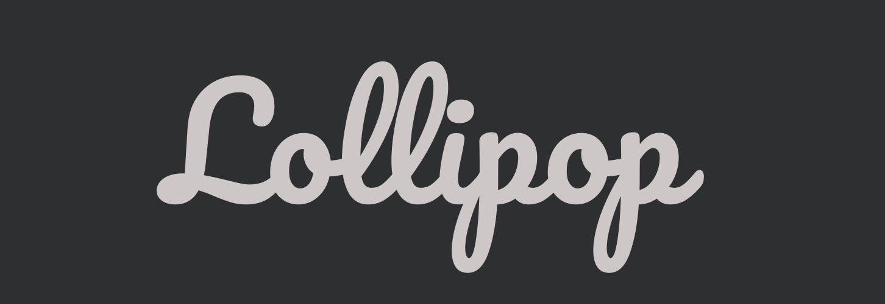
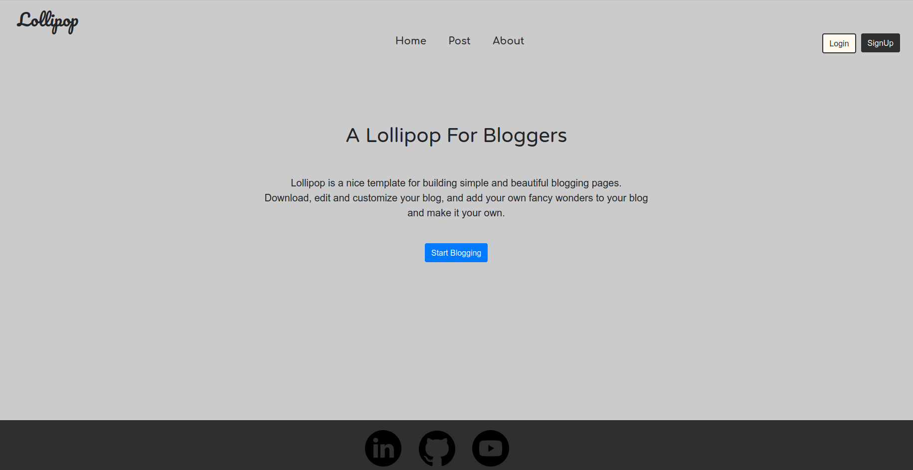

# Lollipop

 
 
**Lollipop** is a *Royal Pickup* For Having Your Status More Updated and 
Focused By *Posting and Blogging* Developed With **Ruby on Rails**. 
**A Nice Provider** For Blogging *Latest Status* For Your Domain Or Even Public Domains.

# Material
    

| Materials | Detail | Description |
| ---------- | ----------- | ----------- |
| Rails | Version 6 | Ruby On Rails Framework. |
| Bundler | Version 3.4 | Bundler For Installing Gems Credentials. |
| SQLite | Version 3 | SQLite Database Managment For Handeling and Storing Posts Contents. |
| Bycrypt | Version 3.4 | Bycrypt Gem For Hashing and Encrypting Database Passwords. |
| Html | Version 5 | For Contenting Lollipop |
| Css | Version 3 | Main Used Language For Styling Lollipop Contents. |
| Scss | Style Variables | Used For Decreasing The Confusion for Color Managment and Other Stuffs.|
| Google Fonts | Link Tags | Embed Links to Main Source Including Pacifico, Roboto and Bangers.  |

# License
Copyright 2019 Ashkan Ebtekari

Permission is hereby granted, free of charge, to any person obtaining a copy of this software and associated documentation files (the "Software"), to deal in the Software without restriction, including without limitation the rights to use, copy, modify, merge, publish, distribute, sublicense, and/or sell copies of the Software, and to permit persons to whom the Software is furnished to do so, subject to the following conditions:

The above copyright notice and this permission notice shall be included in all copies or substantial portions of the Software.

THE SOFTWARE IS PROVIDED "AS IS", WITHOUT WARRANTY OF ANY KIND, EXPRESS OR IMPLIED, INCLUDING BUT NOT LIMITED TO THE WARRANTIES OF MERCHANTABILITY, FITNESS FOR A PARTICULAR PURPOSE AND NONINFRINGEMENT. IN NO EVENT SHALL THE AUTHORS OR COPYRIGHT HOLDERS BE LIABLE FOR ANY CLAIM, DAMAGES OR OTHER LIABILITY, WHETHER IN AN ACTION OF CONTRACT, TORT OR OTHERWISE, ARISING FROM, OUT OF OR IN CONNECTION WITH THE SOFTWARE OR THE USE OR OTHER DEALINGS IN THE SOFTWARE.

# Development

**Developed With  By Ashkan Ebtekari**
